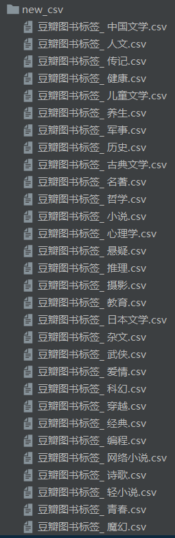
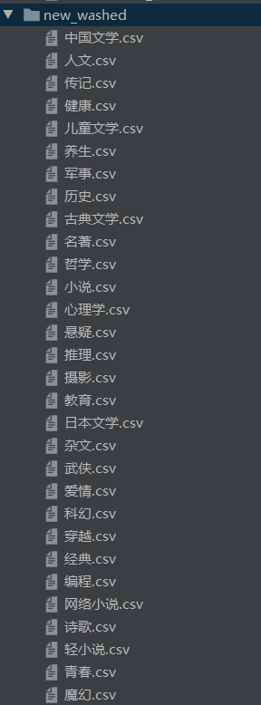
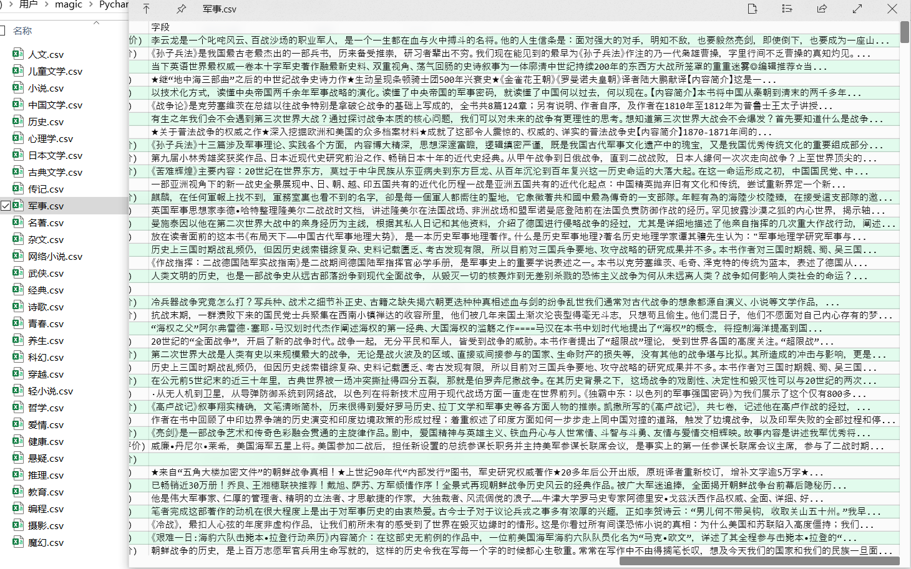
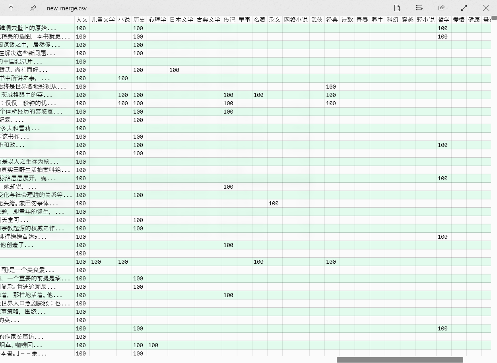

# My Works
## 数据处理
### [进一步清洗][1]
确保除去部分空白符，规整，去重，重命名爬取的数据。

 
### [合并][2]
将相同书名和作者但标签不同的书籍合并，多一个含 30 维标签的向量。

## 敏捷开发协同优化算法
### V1: [随机推送][4]
### V3: [基于书名推送][3]
### V4: [基于 id 推送][5]
### V5: [使用 numpy 优化速度][6]

[1]: ../files/internship_with_cc/deleteBlankSpace.py
[2]: ../files/internship_with_cc/merge_all_data.py
[3]: ../files/internship_with_cc/recomAlg_v3.py
[4]: ../files/internship_with_cc/recomAlg_v1.py
[5]: ../files/internship_with_cc/recomAlg_v4_2.py
[6]: ../files/internship_with_cc/recom_alg_v5_2.py
