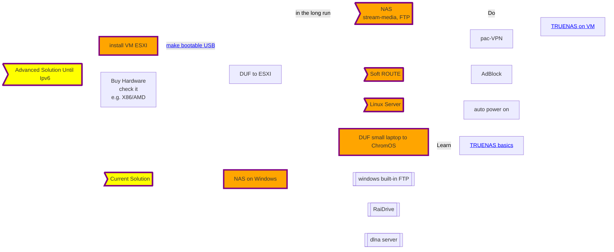

"install VM ESXI"->"TrueNAS Core"
## symble
```txt
> ] 阶段性需要完成的任务
[ ] 分支
=== 相似任务
-.-> 阶段性需要完成的任务 -> 分支, 分支 -> 分支
--> 阶段性需要完成的任务 -> 阶段性需要完成的任务
```
## exp

```mermaid
graph LR
	style A fill:orange, stroke:purple, stroke-width:4px;
	style H fill:orange, stroke:purple, stroke-width:4px;
	style D fill:orange, stroke:purple, stroke-width:4px;
	style L fill:orange, stroke:purple, stroke-width:4px;
	style CUR0 fill:yellow, stroke:purple, stroke-width:4px;
	style IPV6 fill:yellow, stroke:purple, stroke-width:4px;
	style CUR1 fill:orange, stroke:purple, stroke-width:4px;
	style DUFSCOM fill:orange, stroke:purple, stroke-width:4px;
	linkStyle default color:#000000, stroke:white, stroke-width:1px;
	IPV6>Advanced Solution Until Ipv6] --> A[install VM ESXI]
	A -- <a style='color: blue' href='https://www.youtube.com/watch?v=RPtmyttJu2o'>make bootable USB</a> --> B[DUF to ESXI]
    	B -- in the long run --> H>NAS <br>stream-media, FTP</br>]
    	
    H -- Learn --> I[<a style='color: blue' href='https://www.truenas.com/getting-started/'>TRUENAS basics</a>]
    H -- Do --> J[<a style='color: blue' href='https://www.truenas.com/docs/hub/solutions/vmware/'>TRUENAS on VM</a>]
    	I --> J
    	B --> D>Soft ROUTE]
    	
    D --> E[pac-VPN]
    D --> F[AdBlock]
    D --> G[auto power on]
    
    B --> L>Linux Server]
    
    IPV6 --> V61
    V61[Buy Hardware<br>check it</br>e.g. X86/AMD] --> B
    
    CUR0>Current Solution] --> CUR1[NAS on Windows]
    CUR1 .-> H
    CUR1 --> T1[[windows built-in FTP]]
    CUR1 --> T2[[RaiDrive]]
    CUR1 --> T3[[dlna server]]
    CUR1 --> DUFSCOM[DUF small laptop to ChromOS]
    
    %% CURA[enable Windows own FTP] --> CURB[install RaiDrive] --> CURC>as] -- in the short run --> H
```

## 