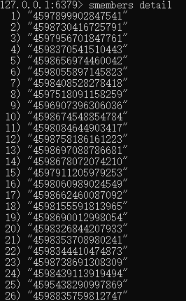
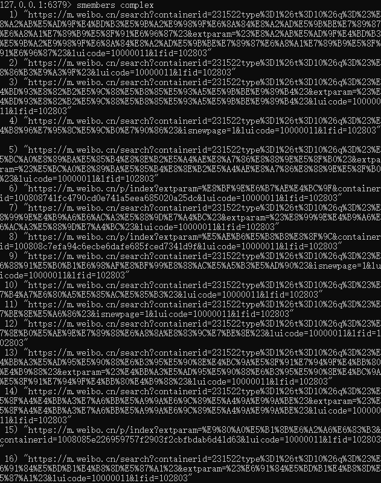
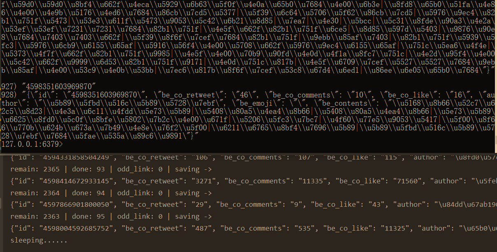

[TOC]

# 爬取手机端微博评论
> 总体感觉实现的方式有点傻，但说不明确哪里不对。
>
> 省略部分细节，例如对数据库的 合并，拆分 等。
>
> 不喜求喷，交个朋友。

## 利用selenium获取进入评论网页的链接

进入 https://m.weibo.cn/ 后，不断将网页向下滚动，获取动态加载的内容，利用redis的set去重，最后获得两种有用的链接。一种形如 `/detail/213113123123124`，一种是包含中文字符的链接（例如：https://m.weibo.cn/search?containerid=231522type%3D1%26t%3D10%26q%3D%23%E6%88%91%E7%9A%84%E5%B0%8F%E7%A1%AE%E5%B9%B8%23&isnewpage=1&luicode=10000011&lfid=102803），需要进入链接对应网页后点击首个评论，之后链接便转换为前者。

由于 链接地址从前者映射到后者 是js动态生成的，而js源码又看得我脑阔疼，也看不出。所以之后通过selenium将后者转换为前者，之后合并两份链接，统一处理。

### 链接获取(code)
```python
from selenium import webdriver
import time
import re
from lxml import etree
import redis
option = webdriver.ChromeOptions()
option.add_argument(r'--user-data-dir=D:\ChromeUserData')
wd = webdriver.Chrome(r'd:\chromedriver.exe', options=option)
wd.implicitly_wait(5)
wd.get('https://m.weibo.cn/')
wd.maximize_window()
scrapied = set()
detail_link = []
time.sleep(2)
pool = redis.ConnectionPool(host='localhost', port=6379, decode_responses=True)
r = redis.Redis(host='localhost', port=6379, decode_responses=True)
while True:
    wd.execute_script("window.scrollBy(0,3000)")
    TIMES = TIMES + 1
    html = wd.page_source
    selector = etree.HTML(html)
    list_m = selector.xpath('//*[@id="app"]/div[1]/div[2]/div[2]/div')
    print(len(list_m))
    for raw_link in list_m:
        link = raw_link.xpath('./div/div/article/div/div/div[1]/a/@href')
        if len(link) >= 1:
            link = link[0]
        else:
            link = None
        link = str(link)
        if re.match('/status', link):
            r.sadd('detail', link.split('/')[2])
        elif len(link.split('/')) > 3 and link.split('/')[2] == "m.weibo.cn":
            r.sadd('complex', link)
        else:
            print(link)
    wd.execute_script("window.scrollBy(0,6000)")
    time.sleep(2)
```

#### 效果二瞥



### 链接转换(code)

> 写得很丑，三个账号轮流切换，操纵js点击，数据解析，都在中间件里了，其它地方的代码不贴了，理解万岁。

```python
def process_response(self, request, response, spider):
    print("spider.which_option: " + str(spider.which_option) + "  num: " + str(spider.p_num)+ "  remain: " +
                  str(spider.r.scard("union_3_9")) + "  no_button_or_formatted: " + str(spider.no_button))
            if spider.p_num % 34 == 0:
                print("sleeping...")
                sleep(1000)
            if spider.p_num % 10 == 0:
                print("have scrapped: " + str(spider.p_num))
                if spider.which_option == 2:
                    spider.bro.quit()
                    option2 = webdriver.ChromeOptions()
                    option2.add_argument(r'--user-data-dir=D:\ChromeUserData2')
                    spider.bro = webdriver.Chrome(r'd:\chromedriver.exe', options=option2)
                    spider.bro.implicitly_wait(5)
                    spider.bro.get(request.url)
                    spider.which_option = 1
                elif spider.which_option == 1:
                    spider.bro.quit()
                    option1 = webdriver.ChromeOptions()
                    option1.add_argument(r'--user-data-dir=D:\ChromeUserData1')
                    spider.bro = webdriver.Chrome(r'd:\chromedriver.exe', options=option1)
                    spider.bro.implicitly_wait(5)
                    spider.bro.get(request.url)
                    spider.which_option = 0
                else:
                    spider.bro.quit()
                    option = webdriver.ChromeOptions()
                    option.add_argument(r'--user-data-dir=D:\ChromeUserData')
                    spider.bro = webdriver.Chrome(r'd:\chromedriver.exe', options=option)
                    spider.bro.implicitly_wait(5)
                    spider.bro.get(request.url)
                    spider.which_option = 2
            else:
                spider.bro.get(request.url)
            sleep(2)
            try:
                button = spider.bro.find_element_by_xpath(
                    '//*[@id="app"]/div[1]/div[1]/div[4]//div/footer/div[2]/i | //*[@id="app"]/div[1]/div[1]/div[5]//div/footer/div[2]/i')
            except:
                button = None
            if button:
                spider.bro.execute_script('arguments[0].click();', button)
            else:
                try:
                    print(spider.bro.find_element_by_xpath('/html/body/div/p/text()').extract_first())
                    exit()
                except:
                    print("no button")
                    spider.r.srem(spider.db_c, request.url)
                    spider.r.sadd('no_button', request.url)
                    spider.no_button = spider.no_button + 1
                    return response
            sleep(2)
            spider.p_num = spider.p_num + 1
            link = str(spider.bro.current_url)
            ll = link.split('/')
            if len(ll) >= 5 and ll[3] == 'detail':
                spider.r.sadd('c_detail', ll[-1])
                spider.r.srem(spider.db_c, request.url)
                print("spider.bro.current_url: " + link)
            else:
                # 这里直接从数据库中删掉
                spider.r.srem(spider.db_c, request.url)
                spider.no_button = spider.no_button + 1
                print(link)
            return response
```
#### 效果不瞥


## 获取评论

### 以逸待劳

> 没钱，没IP，没账号，~~没脑子，~~只能sleep。。。
>
> 所谓`sleep`，就是电脑跑，我躺。

因为微博爬的稍微多一点就会被限制，然后就要等个10到20分钟才能继续爬，所以scrapy那个异步的玩意儿没用，异到一半给你个403，然后你还得保留一群没异完的数据来知道自己上次爬到哪儿了，代码量杠杠的，头发萧萧的，效率提升可怜，还不如给爷一个个链接爬，在数据解析那一块直接持久化存储，爬了遇到不是200的，直接一个sleep。当然，可以切换个cookie，或搞两个代理ip试试，如果搞代理的钱给报销就好了，可惜报不得。。爬到结尾遇到ok=0了，说明一条数据完了，把爬过的id在数据库中删掉，相当于保存状态，然后继续下一条。不让它异步，把CONCURRENT_REQUESTS设置为1，感觉拿个框架搞这个有点像高射炮打蚊子。微博需要手机验证码登录真的恶心(比淘宝拿深度学习搞稍微好点)，虽然之后搞个cookie可以解决，鬼想去看源码分析cookie中有没有键是通过时间来验证的，就像有道字典网页版的cookie一样，虽然直接复制cookie在之后爬【被评论的文本】确实有效果。

微博账号|手机号 少，代理IP仅限翻墙用的VPN，我甚至想 搞个 多个热点、一个wifi、一个VPN 自动切换的脚本，但理智与对自己精力与实力清醒的认识让我放弃了这个冲动。

人生不易，躺平： 以逸待劳

### 爬取清洗并持久化存储被评论的文本信息(code)

> 开始用 requests 做试验，然后 scrapy 实现，结果同样的思路，scrapy 中除了多了这个场景不需要的异步，还出现了一个很诡异的问题，估计是我 cookie 设置没有生效，爬到一半又是弹出登录界面，不过这个报错我 requests 中没遇到过，暂且将这个错误情况收入囊中，给之后的 requests 用。scrapy 框架是死的，requests 库是活的，所以 评论的爬取与持久化存储 用 requests 了。
> 
> 写这玩意儿花了我将近一天时间，呜~  数据量越大，边界条件越复杂，真是【if else try catch 地狱】啊！

```python
import requests
import re
import redis
import json
from time import sleep
db_key = 'copy_all'
headers = {
"user-agent": "Mozilla/5.0 (Windows NT 10.0; Win64; x64) AppleWebKit/537.36 (KHTML, like Gecko) Chrome/88.0.4324.104 Safari/537.36",
"cookie": "WEIBOCN_FROM=1110006030; SUB=_2A25NEV0tDeRhGeBL7lYY9ybFyDiIHXVu-mNlrDV6PUJbkdAKLXbwkW1NRutLlmTowwVwMFvx2VGceNikaFWGhsY8; MLOGIN=1; _T_WM=67795908980; M_WEIBOCN_PARAMS=oid%3D4598439113919494%26luicode%3D20000061%26lfid%3D4598439113919494%26uicode%3D20000061%26fid%3D4598439113919494; XSRF-TOKEN=657a72"
}
be_cf_url = "https://m.weibo.cn/detail/{}"
pool = redis.ConnectionPool(host='localhost', port=6379, decode_responses=True)
r = redis.Redis(host='localhost', port=6379, decode_responses=True)
id_pool = r.smembers(db_key)
continous = 0
cannot_sum = 0
interval_controller = 1
headertimes = 1
for u_id in id_pool:
    interval_controller += 1
    if interval_controller % 97 == 0 or headertimes % 11 == 0:
        print("sleeping......")
        headertimes = 1
        interval_controller += 1
        sleep(1000)
    continous = 0
    be_c_url = be_cf_url.format(u_id)
    be_res = requests.get(url=be_c_url)
    if be_res.content and be_res.status_code == 200:
        bec_l = re.split(r'"text":|"textLength":|"source":', be_res.text)
        if len(bec_l) < 2:
            print('now that I use headers')
            headertimes += 1
            be_res = requests.get(url=be_c_url, headers=headers)
            if be_res.content and be_res.status_code == 200:
                bec_l = re.split(r'"text":|"textLength":|"source":', be_res.text)
            else:
                print("how come???  " + be_c_url)
                exit()
            if len(bec_l) < 2:
                print("napping...")
                print("odd: " + be_c_url)
                r.sadd("odd_link", u_id)
                with open('assert_login_required.html', 'w+', encoding='utf-8') as f:
                    f.write(be_res.text)
                sleep(4)
                continue
        else:
            be_emoji_contents = bec_l[1]  # 1 big
            be_emoji = re.findall(r'alt=\[(.+?)\]+', be_emoji_contents)
            be_contents = re.findall(r'[\u4e00-\u9fa5]+', be_emoji_contents)
            author = re.split(r'"profile_image_url":|"screen_name":', be_res.text)[1].strip()[1: -2]
            be_co_list = re.split(r'"reposts_count":|"comments_count":|"attitudes_count":|"pending_approval_count":', be_res.text)
            be_co_retweet = re.findall(r'\d+', be_co_list[-4])[0]
            be_co_comments = re.findall(r'\d+', be_co_list[-3])[0]
            be_co_like = re.findall(r'\d+', be_co_list[-2])[0]
        be_emoji_ser = '|'.join(be_emoji)
        be_contents_ser = '|'.join(be_contents)
        obj = {"id": u_id, "be_co_retweet": be_co_retweet, "be_co_comments": be_co_comments,
               "be_co_like": be_co_like, "author": author, "be_emoji": be_emoji_ser, "be_contents": be_contents_ser}
        value = json.dumps(obj)
        if r.hset("vb_article", u_id, value):
            print("remain: " + str(r.scard(db_key)) + " | done: " + str(interval_controller - 1) + " | odd_link: " + str(r.scard("odd_link")) + " | saving -> ")
            print(value)
        else:
            print("remain: " + str(r.scard(db_key)) + " | done: " + str(interval_controller - 1) + " | odd_link: " + str(r.scard("odd_link")) + " | duplicated -> ")
            print(value)
        r.srem(db_key, u_id)
    else:
        try:
            print(be_res.text)
            print("的确把我禁了，呜——")
        except:
            print("WTF?!")
        print(be_res)
        exit()

```
#### 效果一瞥

> 还在爬，先瞥了。



### 爬取并持久化存储评论别人的文本信息(code)

> 这个数据量更大，还没写。