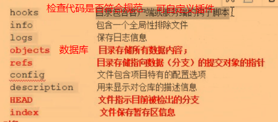
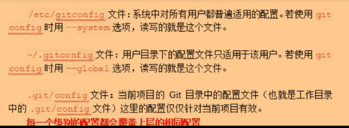
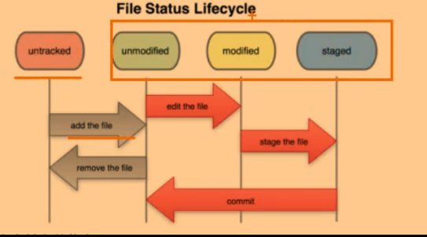
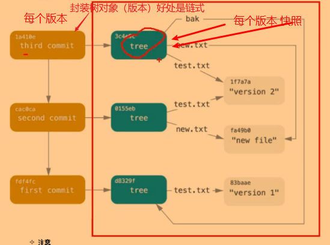

# git

## 概览

git 目录下



```shell
find 目录名  # 将对应目录下的 子孙文件&子孙目录 平铺在控制台
find 目录名 -type f  # 将对应目录下的文件平铺在控制台
```

### 初始化

```shell
git config --global user.name "your_name"
git config --global user.email your_email
git config --list
```



## 基本命令原理

+ 高层命令：由多个底层命令组成
+ 区域：工作区，暂存区，版本库
+ 对象：Git 对象，树对象，提交对象

```shell
git init

# 仅列出修改过的文件
git status

# 查看哪些修改还没暂存
git diff

# 查看哪些修改被暂存了还没被提交
git diff --staged

# 将修改添加到暂存区
git add .  # 生成 git 对象（修改了当前工作目录中的文件）
# 目标文件快照 ==> 工作目录 -> 版本库 -> 暂存区 ==> 未跟踪变已跟踪状态

# 将暂存区提交到版本库
git commit -m "xxx"  # 参照暂存区，生成树对象，放到版本库（对暂存区作快照）-> 树对象 加上注释信息 包裹封装成 提交对象

# 跳过使用暂存区
git commit -a
```

