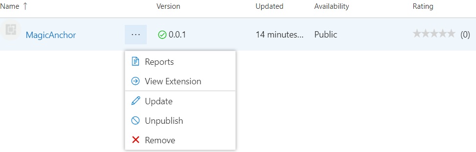

## 发布流程

### 直接上传

### 根据官方文档

使用token管理

https://docs.microsoft.com/en-gb/azure/devops/organizations/accounts/use-personal-access-tokens-to-authenticate?view=azure-devops&tabs=preview-page

## 经验

### TS 语法

Number(xxx) 有0 不用C++ isdigit

强类型如何开？（eslint有无这种风格：必须有分号，类型必须声明，两个空格）

#### 需要练习

定义回调函数

将异步操作(如readfile) 变为同步(控制顺序)

实现hook一样的闭包

python装饰器

### 开发流程

注释{最后}删

测试在开发目录下

{有时}正则匹配不如自己写算法，两者比较后再决策

找API或轮子切忌完美主义，不如自己改造或完全自己写

### 模块划分

每个模块可测试，自底向上构建时以数据流为主体，就像积木是从地面上搭起来的一样

###  调研咨询

明确别人的使用场景与需求，现有的解决方案，别人在用自己的东西时候的体验

  