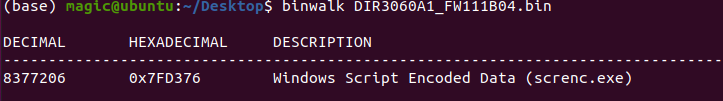
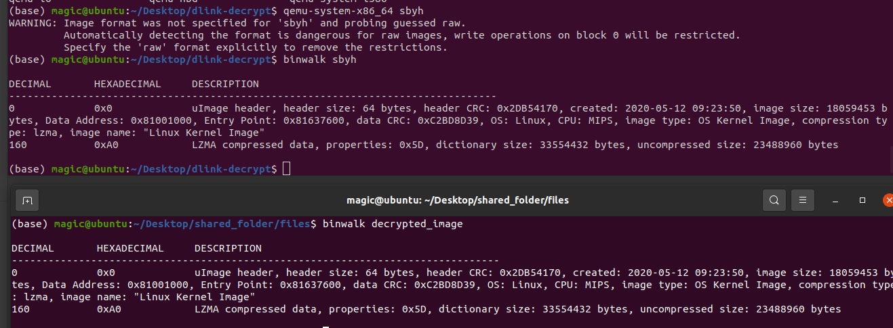
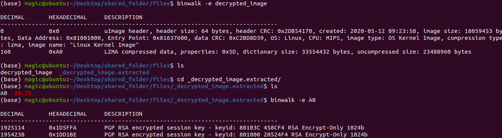
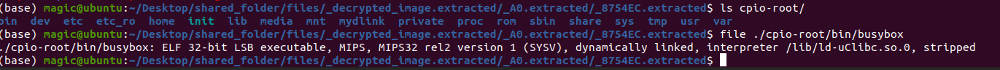
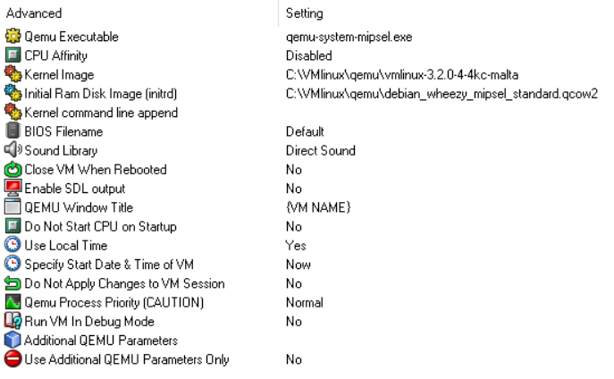
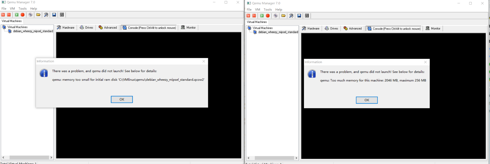

# 固件解密

## 茴有四种写法

### 茴
用 https://github.com/fkie-cad/fact_extractor/tree/master 中 docker 的方式，注意**文件目录结构**要按照它要求的来创建，不然它会报错文件路径找不到


#### 文件目录结构

```txt
<path_to_shared_folder>
├── files
├── input
│   └── firmware_file
└── reports
```

#### 执行命令

```shell
sudo docker run -v /home/magic/Desktop/shared_folder/:/tmp/extractor -v /dev:/dev --privileged --rm fkiecad/fact_extractor
```

解秘后的文件在files中

### 回 
用 https://github.com/0xricksanchez/dlink-decrypt 中的脚本，先要`easy_install pycrypto`一下，否则会[报错][1]，

#### 运行
```shell
python3 ./dlink-dec.py -i <in> -o <out>
```

## 结果

### 解密前



### 解密后



两个工具解密以后得到的结果一样，说明解密部分`99.9999%`成功了

## 经验

docker 的 image create container 后，container 里面可能会有自动检测程序，如果没有**按照规定的方法指定容器数据卷或其它外部传参命令**，改container会自动退出。

# qemu 模拟运行

## 步步解压

参考[博客][2]



```shell
# loop
binwalk -e xxx  # xxx is the file to extract
# wait sync
cd yourfile.extracted/
# ls and find xxx xxx.7z
# goto: loop
# 到最后，若发现 cpio-root，则
tar zcf cpio-root.tar.gz cpio-root
```

记得看一下



如果是小端的，就要将`cpio-root.tar.gz`发送到**QEMU MIPSEL**中的 **rootfs folder** 

## qemu

### 常识

```txt
mips 是32位大端字节序 
mipsel 是32位小端字节序 
mips64el 是64位小端字节序 

Initrd ramdisk或者initrd是指一个临时文件系统，它在启动阶段被Linux内核调用。initrd主要用于当“根”文件系统被挂载之前，进行准备工作
```

### 放弃的方向(坑)

以 Windows 为 host，用 qemu manager, 参考 https://people.debian.org/~aurel32/qemu/mipsel/README.txt 中 `qemu-system-mips64el -M malta -kernel vmlinux-3.2.0-4-5kc-malta -hda debian_wheezy_mipsel_standard.qcow2 -append "root=/dev/sda1 console=tty0"` 配置GUI



然后，无论我把RAM调大还是调小，都会报错，妈的自相矛盾的bug。



然后我又试了`qemu-system-mipsel -M malta -kernel vmlinux-2.6.32-5-4kc-malta -hda debian_squeeze_mipsel_standard.qcow2 -append "root=/dev/sda1 console=tty0"`，还是老问题。


[1]: https://stackoverflow.com/questions/19623267/importerror-no-module-named-crypto-cipher
[2]: https://tsublogs.wordpress.com/2019/12/16/emulate-d-link-dcs-932l-camera-using-qemu/