## 入名

> 道可道

+ 能够准确陈述问题：一旦能够说出什么东西的名字，就会很容易注意到
  它。你就会掌握它，拥有它，让它受你所控。
+ 目的：信息的表达优先级压缩美观

## 原则

### 亲密性

+ 信息之间的 联系|差异 映射到视觉，聚、散、形、空间、强调。一眼获得大量信息。
+ 简单表达 > 不专业的设计
+ 视觉单元归组，3~5组。视线路径有始有终。条理性、组织性。
+ 避免：
  
  + 元素 -> 孤立，角落，中央
  + 留白大小相同
  
### 对齐

+ 分离但同一组. 关联. 视觉纽带
+ 避免使用居中对齐, 改变对居中的刻板印象
+ 尽量只使用一种文本对齐, 打破常规对齐前清楚规则是什么

### 重复

> React 组件的魅力

+ 粗体, 来回跳, 使目光尽可能长时间地停留
+ 模板|主题, 一致性(标题|页眉|页脚|边框|页码|字体|行距|图例和注记), 才可以突出与众不同的元素(以墙内花里胡哨的UI为反面教材)
+ redifine重复: 图片|字体|剪贴画|大小|角度|颜色|风格|不一定完全相同的存在明确关联的紧密相关的对象(抽象元素)|抽取元素重新设计
+ 避免过多重复一个元素

### 对比

+ 元素层次结构, 截然不同, 而不是不完全相同
+ 字体|线|颜色(背景)|大小

### 糖

借鉴|魔改 别人的 布局|模板

## 颜色

### 互补

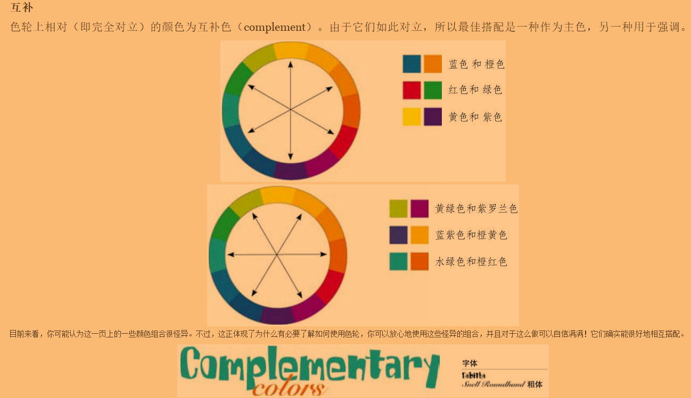

### triad

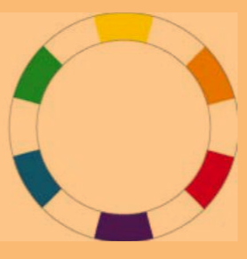

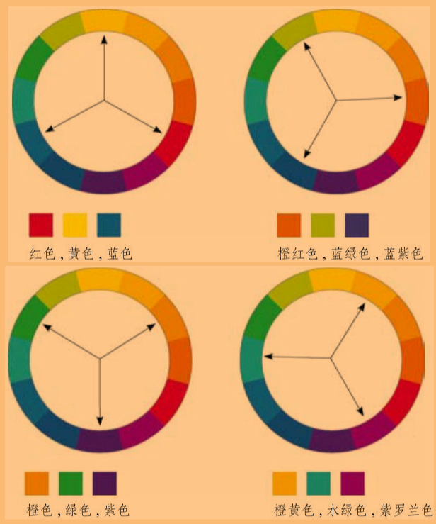

#### primary triad

> 1

#### secondary triad

> 1

#### tertiary triad

> 2

### split complement

> 更为细致的颜色边界

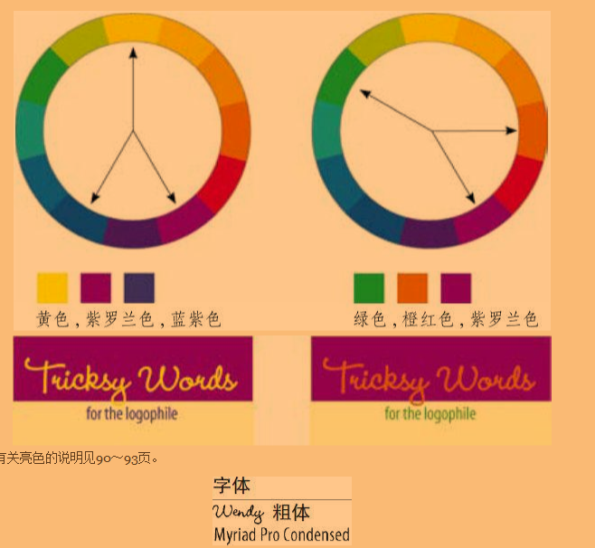

### 色调

+ `+`黑 `->` `shade`
+ 纯色 `->` `hue`
+ `+`白 `->` `tint`

### 冷暖

+ 冷：蓝。后退。使用更多的冷色，产生有效的对比。
+ 暖：红|黄。趋近型。
+ 取舍：季节性。红黄 夏，蓝 冬，橙棕 秋，绿 春。
+ 滴管取色 | 自制调色板 | 颜色模板 （直接算法根据规则配色可以吗？？e.g. 三颜色的角度，转。）

### 其它

+ CMYK：印刷时用
+ RGB：屏幕上用。转为CMYK会有数据损失。

## 优秀案例

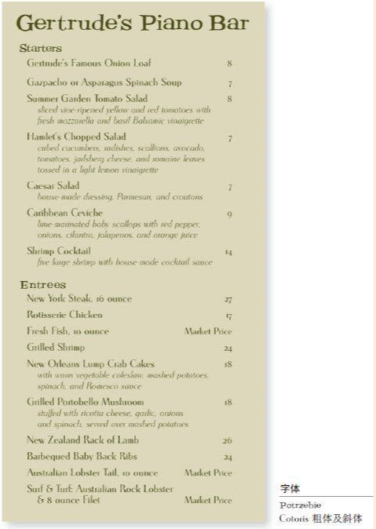

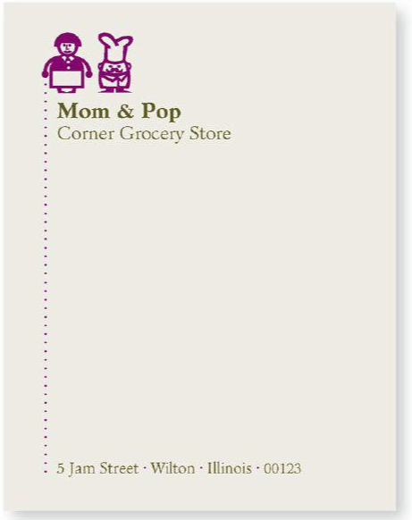

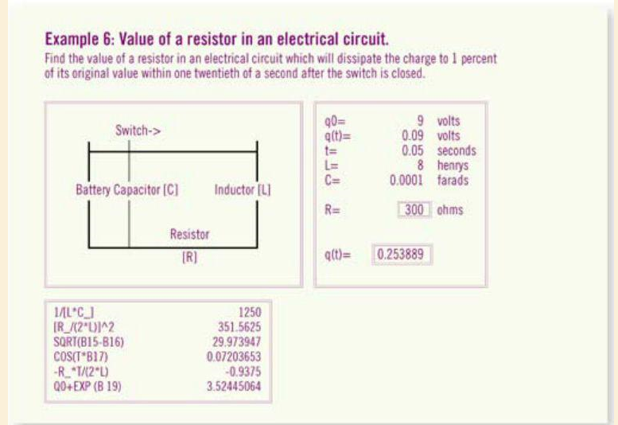

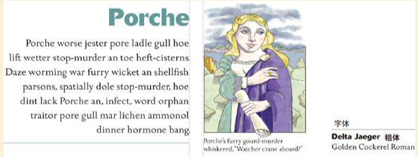

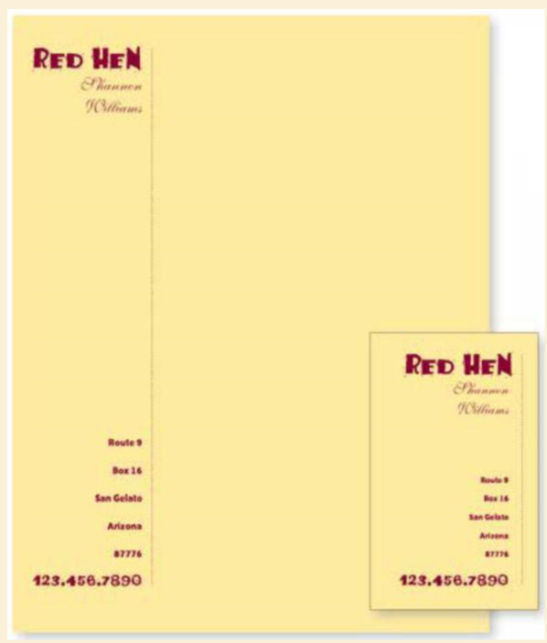

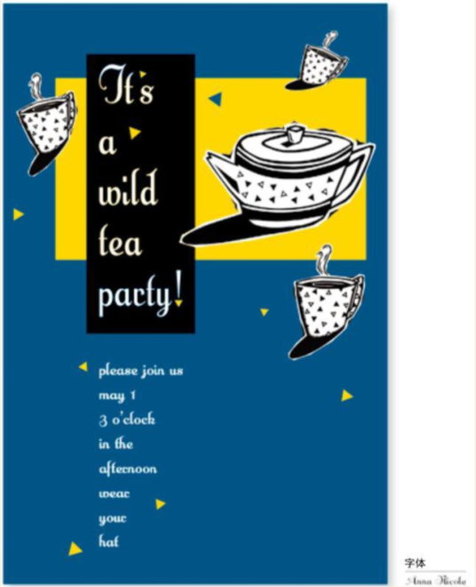

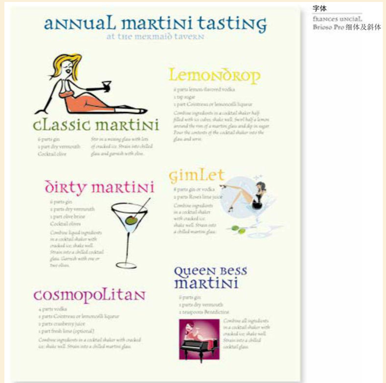

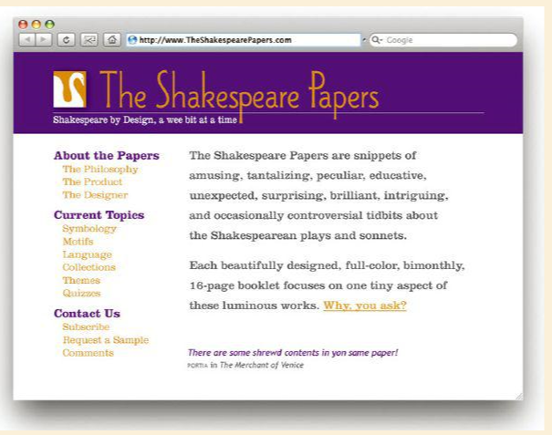

## sdf