市场规模：看天花板

---

公司名字：两个字，外国人能读，朗朗上口 **注册.com域名**等等

---

**专注**：在擅长干的事情上

 极致：做到让自己逼疯了吐血：）

 口碑：不要被营销过度包装，真材实料让用户满意，超出预期

 快：对相关热点风声反应要快

---

获得融资：交朋友，让别人相信你（认真做人，工作，有原则（不收车马费）有梦想，懂行），建立信用（熟人）【信用和恩德】

---

商业计划书VC是不看的，没用，他们假定这些东西是你编出来的，还是要看**信用和声誉**，**投资者非常关注创业团队（本质上投的是人）**，一两句话说明你们干什么，做的东西要简单。

---

本分 + 梦想大

---

留足账面上的现金，不缺钱的情况下，融资会很轻松，让VC和PE找你。

花了一半的钱就要找钱了，不要等到缺钱了再找，不然就没有议价能力了。

专注于业务，让投资者找你。谦和，愿意沟通，表达自己的自信。

A轮VC想知道“你怎么帮我挣十倍”

钱可以输，人不能输。即使搞砸了，也要维护好和投资者之间的关系。

---

做价高对应更高的预期，如果做不好，投资者会沮丧，会给你施加各种压力让你动作变形。追求合理的做价，还要考虑到下一轮。

做价：[市场调查]先问3-5家无关（最不可能投）的人。不要开始很高，后来价格越来越往下走。要看信心，要有信心，信心和价格同步，市场价中间偏上走。

---

要做什么，直接去做

---

前提，长项：你是不是公司的核心价值，是不是在做你懂的东西。**专注**

---

股权分配要合理。你只拥有股份。拿100%的股份（梦想）和 钱 工程师 销售 资源 share

不要极左也不要极右（100%自己股份，成功的概率近乎=0）。

share梦想，寻求认同，揭示风险，明确他在创业过程中的角色，了解对方的期望值和自己能给的条件是什么，要让他们有足够的拥有感，**讨论过程中不要伤了感情，注意交流这个人的感受**

---

所有co-founder的股份锁定4年（干不满4年是没有股份的）[有助于看合不合适之类的]。亲兄弟，明算账，把退出机制谈好

劝合伙人退股沟通：统一价值观，一个公理系统，大家都要遵守的规则和逻辑。假定未来5-10年或一辈子都干这个公司。

如果是一人一半，创业之前说清楚，如果出现了原则性分歧，应该听谁的，如果平均分成3份及以上，公司基本没戏。一定要有一个人有领导力说话权权威存在。

---

最重要的问题：账面上还有多少现金，假设没有任何现金流入，还能撑几个月（要求：一年）？

关心是不是真正的钱进来了（不要管未来预期收入）：现金流

人才问题：装孙子等方法**搞定**人才

---

产品满足消费者需求：懒 爽 更强大

假设消费者更傻

需求基于欲望，不可被创造，消费者只知道自己的抽象需求，我们要洞察发现满足需求。需求在那里，只是在等待被满足

需求（7情6欲，6根）才是市场（现象学）

代际需求（畜生们产品一定要追求最新的，比如iphone5678）

---

### 需求 增长

行为上瘾的著作《欲罢不能：刷屏时代如何摆脱行为上瘾》一书中，他列举了六项行为上瘾的构成要素，分别是：

- 诱人的目标
- 无法抵挡且无法预知的积极反馈
- 渐进改善的感觉
- 越来越困难的任务
- 需要解决却暂未解决的紧张感
- 强大的社会联系

抖音的设计：

- 不可预知：下滑刷新
- 即时反馈：视频自动播放
- 嘎然而止：短视频，意犹未竟

因为每个产品经理、营销人、创业者都会问：**我是服务大众呀，还是服务精英呢？**

**“创业做消费品，一定要做让人上瘾的品类”。**

**创业一定要顺着人性走。****准确来说，利用人性的负面走。**人性是懒惰，你就顺着他懒；人性贪，贪吃贪玩，你就要不断奖励，甚至添加刺激多巴胺分泌的元素；人性逐利，你就不断用蝇头小利，分成各种阶段、等级分发给他；总之，这样的品类永远是最赚钱的。

人欲即天理，用户调研，尊重人欲，清空自己接纳别人的世界观

春节是社交网络的活跃期，聪明的营销者应该创造性的抓住这个机会。

吸引人才的四个方面：**短期回报、长期回报、个人成长、精神生活**。

堆砌的产品没有安全感，准确的抉择才有。

组织的成果要在组织之外，不要把做完了某某项目说成成果，而是应该始终关注对外体现的成果。

　　如，用户在什么方面得到了提升，公司在业界得到了什么益处。

　　是。即，用户视角，禁止自我陶醉。

---

口碑的本质：超出用户预期

---

互联网 特点：快。先发优势。击败前面的东西的一定不是后面的copy，而是后面更新的东西e.g. 门户网站(雅虎) -> 搜索引擎(google) -> facebook。

所以，找风口。e.g. 前两个decades，移动互联网&视频

模式的优越性 + 台风口

---

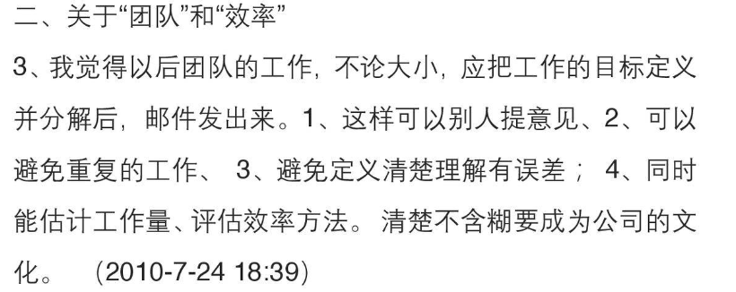

---

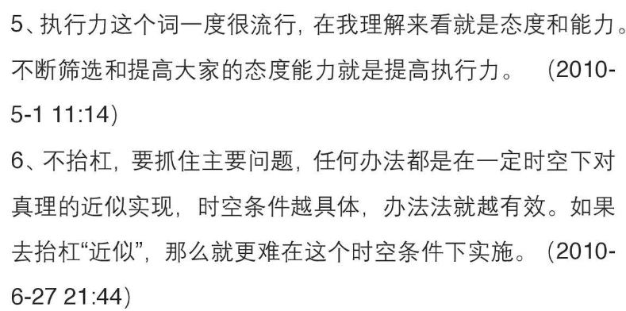

---

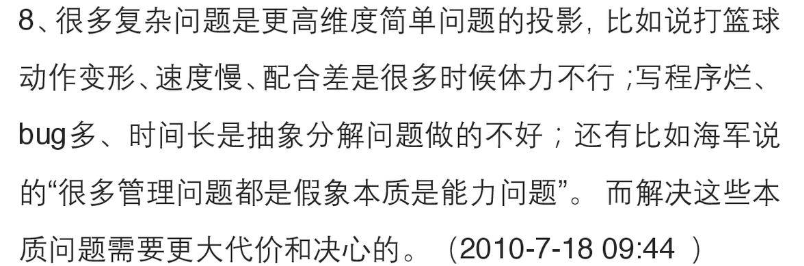

---

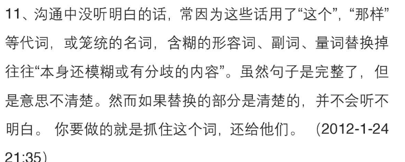

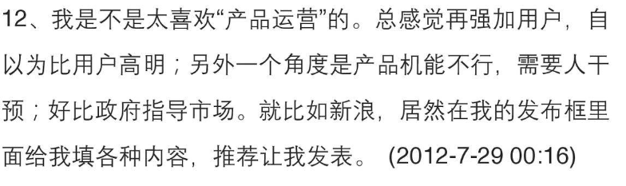

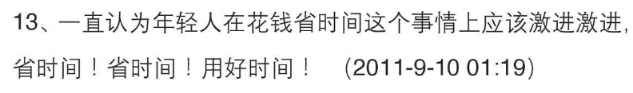

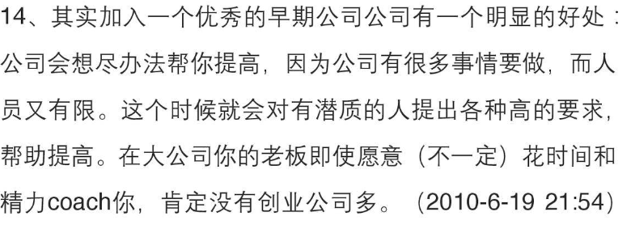

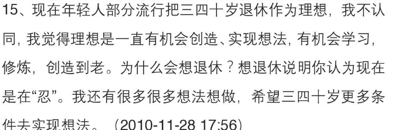

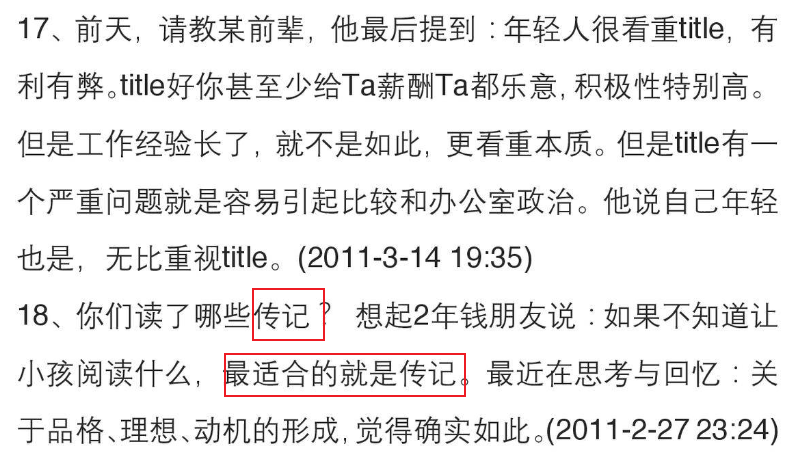

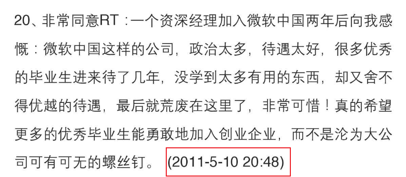

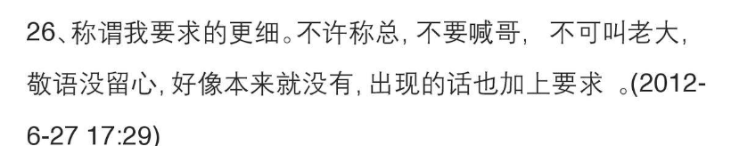

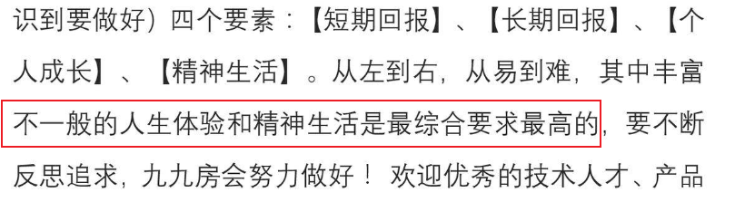

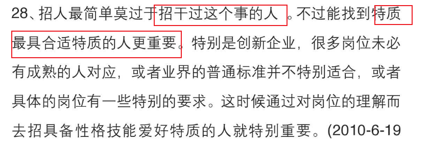

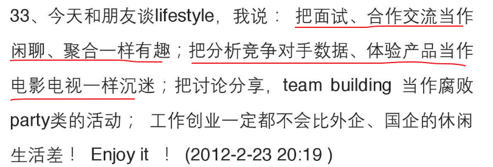

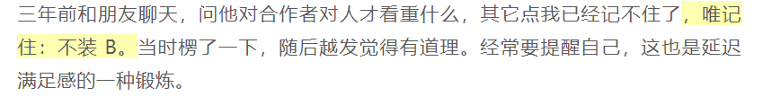

与智慧的常见敌人：未延迟的满足感，经验带来的麻痹或恐惧。

谋事不求易成，具备强烈的成功动机和韧性才能成功。

应该让肾上腺素和理智一起发挥作用。

练习保持耐心，即使是快节奏和压力的情况下。

年轻人不要试图追求安全感，特别是年轻的时候，周遭环境从来都不会有绝对的安全感，如果你觉得安全了，很有可能开始暗藏危机。真正的安全感， 来自你对自己的信心，是你每个阶段性目标的实现，而真正的归属感，在于你的内心深处，对自己命运的把控，因为你最大的对手永远是自己。

短期交往说话忽悠会有溢价，长期交往说话实在会有溢价。

用心认真的折腾是没有风险的。（不焦虑于方向）

注意力也可以开源节流的，欲望和杂念分散注意力要节流，锻炼身体和注意力训练是开源

想学的东西很多，吾生有涯知无涯，以有涯追无涯，殆也。有两种理解，积极的理解是应该有优先级的规划学习。

很多很好的想法自己都非常认真，现在都被人实现或者通往实现的路上了。真希望自己能分身体几个同时努力，这样人生多精确。但是分身是不可能的，所以只能 :

\1. 根据情况排优先级

\2. 找到志同道合的人

---

系统地运动锻炼需要抗身体的惰性，锻炼久了之后不但身体好而且锻炼的积极性 也好容易启动养成习惯，最近觉得读书学习也很类似。

平庸有重力，需要逃逸速度。 

当某人开始深入认识自己、研究自己的时候，说明此人开始有了哲学的思考，预示着此人开始迈入一个新的人生阶段。

---

强烈的动机比方法更根本。

---

第一批，明显缺陷者、众人厌恶的说谎者；第二批，不愿交流者、不合群者；第三批，有能力但慵懒者、妄图 坐享其成者；第四批，居功自傲者，蔑视同僚者。

---

\#职场总结#工作基本上是一个积累信誉的过程。自己今天的工作一直在为自己的明天积累信誉。工作中总是掉链子、需要人提醒就是不断的丢掉自己的信誉。We are what we repeatedly do,not we repeatedly think or want or say.

---

---

## hhy

写东西前明确需求。需求是不变的，代码、工具是变的（失效，优化。。。）

---

看相

