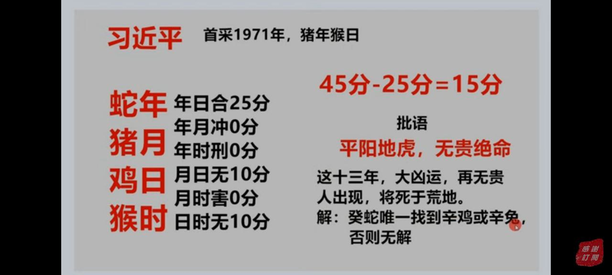
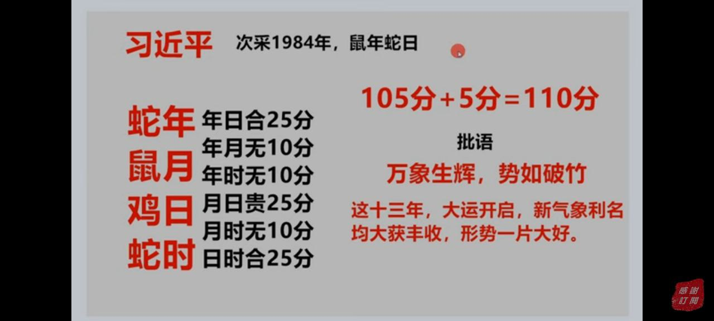
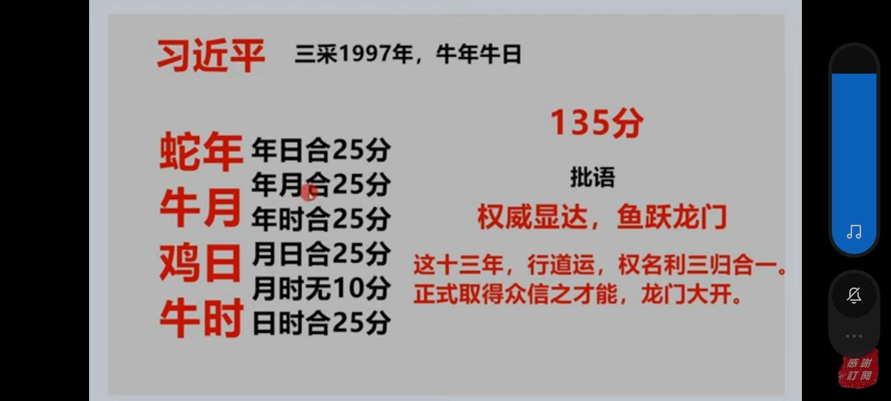
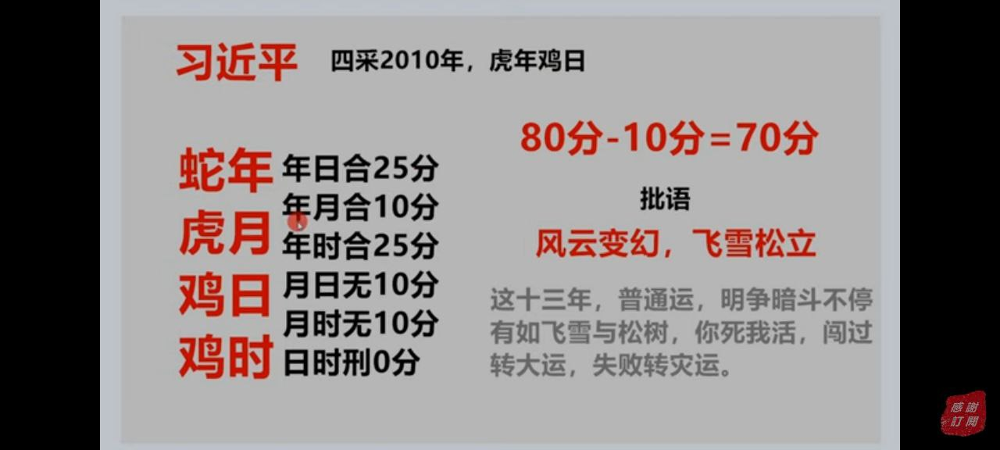
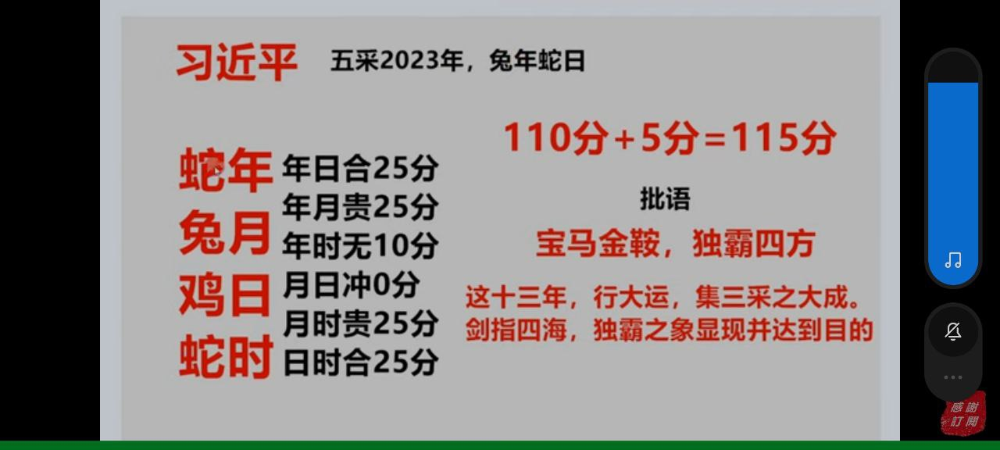
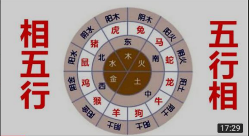

## 天下第一相
年时：肉身，健康 。冲：损财。【知道损失多少】刑：病伤。害：财损。【不知道损失多少】贵：福&气(福分，安享平安，从气质看出)。

月时：子孙传承，只是对父母好（马猪贵父，蛇羊贵子）。冲：子孙不和。刑：子孙生伤。害：子孙内病。贵：前&后(前辈，后人)。

日时：自身物质精神财富的传承, 健康（老年，比例最高）-> 家业传承。冲：家业纷争。刑：事业折损。害：己病业无。【家业，事业】贵：体&传(身体，传承，基业的传承)。

月日：冲：父子无和。刑：父子生伤。害：父子内病。贵：生&基(生命，基业，基业的到来)。

年月：刑(年少时不顺)。冲：不和。刑：仇敌。害：遗病（遗传病）。【与家族】贵：名&利。

年日：个人发展，若贵和可能可解决 年月、月日。冲：坏名。刑：生伤。害：内病。贵：权&利。

鼠牛，马羊：防守组合

龙鸡，虎猪：攻击组合

马龙显高傲

马虎显尊贵

猪马和局没事

龙龙组合胆大

鼠马：拼命玩命

鼠羊：漏财

蛇配虎：做坏事

单贵顶不住害

蛇兔：代表巨大财富

月日，月时 贵 均能解决日常意外事，父母辈支援力度大

狗兔：代表谋略一流

木火：王相五行，从政或科学工程 或 木火类商业

木火生权，火木生财

虎马：人聪明，完美主义要求自己可取财

马猪：孝子贵

坏相是警世通言

冲是导火索，冲害易有大事

### 案例

### 原理图

## 网络问答

### 相五行

> 职业

火生土，土生金，金生水，水生木，木生火

太旺需要克

猴、鸡属金，
虎、兔属木，
猪、鼠属水，
蛇、马属火，小火（互联网）
龙、羊、狗、牛属土。

### 三合
大合
六合好比夫妻之亲，三合则犹如母子之情。
三合：三合是种「明合」，光明正大地合。就是三个生肖的吉配。
三合的组合，不但契合度佳，思想、价值观、习惯、动作.......总认为是那么情投意合。三合生肖相差四年，正所谓差4岁结婚，才是天作之合，就是根据「三合」而来的

申子辰、三合..........属猴、属鼠、属龙，三合为一组吉配。 
巳酉丑、三合..........属蛇、属鸡、属牛，三合为一组吉配。 
寅午戌、三合..........属虎、属马、属狗，三合为一组吉配。 
亥卯未、三合..........属猪、属兔、属羊，三合为一组吉配。

### 六合
小合
六合：六合是种「暗合」，暗中帮助你的贵人。六合不是六个生肖组成。而是六组「贵人」。
太极两仪三才四象五行 六合七星八卦九宫
上下四方谓之六合 就是天地+东西南北 任何一组的两个人，冥冥之中、相处就是那么融洽，且相互都很愿意帮助对方。 

子丑、六合............属鼠与属牛，为一组贵人 
寅亥、六合............属虎与属猪，为一组贵人 
卯戌、六合............属兔与属狗，为一组贵人 
辰酉、六合............属龙与属鸡，为一组贵人 
巳申、六合............属蛇与属猴，为一组贵人 
午未、六合............属马与属羊，为一组贵人 

### 相冲

六冲

相冲，是指六对属相之间的五行冲克，多表现在两人性格脾气与立场观点方面，会形成很大的差异，所以相处起来矛盾多多，极易产生口角。可是往往越是相冲的人，却越容易相互吸引，这是符合异性相吸原理。但是尽管感情上的彼此吸引，但往往在一起相处时，会因为双方性格与观念相差极大，难以融合，所以很难长久，即使勉强走过一段路程，但最终分道扬镳的可能性极大。有些尽管没有分手或离婚，但是两人中总会有一方事业、健康明显差过另一方很多，感觉被对方压迫，造成整体家运很不好。在连年上表现为血光、投资失利、破财等。 

生肖属相相冲的意思就是不适合在一起，在一起会导致冲突、互相削弱，

生肖相冲、相害、相刑、相破的实质是对应的地支阴阳不调、五行相克、方位背离。以子鼠午马相冲为例，从五行来看子(鼠)属阳水，代表北方，午(马)属阳火，代表南方。从五行来看，因为水克火，所以鼠马五行想冲;

从阴阳来看，鼠马为阳水、阳火，二者皆阳性，属于阴阳不调;从方位上看也是南北分离，子(鼠)代表北方，午(马)代表南方。故子鼠午马相冲。其他类推。通过以上的分析，我们就很好理解属相相冲的原理了，并不是两种动物放在一起犯冲，而是生肖属相之间五行相克、阴阳不调、方位相背。了解了生肖相冲、相害、相刑、相破的原理，化解之法也就不难。只要采用适当的风水法器确保五行流通、阴阳交感即可。

只要在两个相冲的生肖间引入一个相合的生肖，就可有效化解生肖相冲。举一个例子，鼠与牛六合、马与羊六合。当家人间鼠与马相冲的情况下，只要家庭成员间有一个属牛者与鼠相合，或者有一个属羊者与马相合，就可有效化解鼠与马相冲。如果家庭成员中没有这样的属相，可摆放生肖吉祥物牛或羊来化解。

冲是正面的冲突，比如当敌不过对方时还可以跑掉、避开，故冲含有冲走的意思。但相害(穿)就不同了，穿是从侧面而来的,犹如遭遇到敌人的突然袭击,跑都跑不掉，仇敌相见，总要拼个你死我活,而且防不胜防，躲避不开。

#### 子鼠午马相冲;
1、卧室所在方位、床头朝向不宜在南、北方；
2、床边摆一个虎、龙、猴（任选一种）增缘和合；
3、家居宜协调地使用浅绿色来中和；
4、结婚选虎、龙、猴作伴娘、伴郎；
5、生个虎或龙、猴宝宝，作为夫妻和合的纽带；
6、不盲目选取通用嫁娶吉日，必须结合双方八字选取吉日办婚礼。
#### 丑牛未羊相冲;
1、卧室所在方位、床头朝向不宜在东北、西南；
2、床边摆一个蛇、鸡、猪、兔（任选一种）增缘和合；
3、家居宜协调地使用浅金、银白色来中和；
4、结婚选蛇、鸡、猪、兔作伴娘、伴郎；
5、生个蛇或鸡、猪、兔宝宝，作为夫妻和合的纽带；
6、不盲目选取通用嫁娶吉日，必须结合双方八字选取吉日办婚礼。
#### 寅虎申猴相冲; 
1、卧室所在方位、床头朝向不宜在东北、西南；
2、床边摆一个鼠、马（任选一种）增缘和合；
3、家居宜协调地使用黑、蓝色来中和；
4、结婚选鼠、马作伴娘、伴郎；
5、生个鼠、马宝宝，作为夫妻和合的纽带；
6、不盲目选取通用嫁娶吉日，必须结合双方八字选取吉日办婚礼。
#### 卯兔酉鸡相冲;
1、卧室所在方位、床头朝向不宜在东、西方；
2、床边摆一个猪、蛇、牛（任选一种）增缘和合；
3、家居宜协调地使用黑、蓝色来中和；
4、结婚选猪、蛇、牛作伴娘、伴郎；
5、生个猪或蛇、牛、羊宝宝，作为夫妻和合的纽带；
6、不盲目选取通用嫁娶吉日，必须结合双方八字选取吉日办婚礼。
#### 辰龙戌狗相冲;
1、卧室所在方位、床头朝向不宜在东南、西北；
2、床边摆一个马、鼠、猴（任选一种）增缘和合；
3、家居宜协调地使用浅金、银白色来中和；
4、结婚选马、鼠、猴、虎作伴娘、伴郎；
5、生个马、鼠、猴宝宝，作为夫妻和合的纽带；
6、不盲目选取通用嫁娶吉日，必须结合双方八字选取吉日办婚礼。
#### 巳蛇亥猪相冲。
1、卧室所在方位、床头朝向不宜在东南、西北；
2、床边摆一个兔、羊（任选一种）增缘和合；
3、家居宜协调地使用绿色来中和；
4、结婚选兔、羊作伴娘、伴郎；
5、生个兔、羊宝宝，作为夫妻和合的纽带；
6、不盲目选取通用嫁娶吉日，必须结合双方八字选取吉日办婚礼。

### 相害（相穿）

六害

相害是指六对属相之间的五行克害，程度比相冲稍弱。这种相害，实际上是对相合的五行起了一个破坏作用，所以相害的属相结成恋人或夫妻，会无事生非，经常吵架，影响感情，有的最终走向分手或离婚。在流年上表现为健康出现问题，频繁跳槽不满意等。 

相害除了破坏之外，还有一层意思就是“倒”，正的遇害而偏，有时偏的也可以害正。“倒”表示立不住、破坏、消亡，故也常将害说成是“穿倒”。

阴招

子鼠未羊相害;
丑牛午马相害; (丑为湿土，晦火极甚)
寅虎巳蛇相害; 害中带生，被生的一方遇害的时候还有动的意思，且杀伤不严重。
卯兔辰龙相害;
申猴亥猪相害; 害中带生，被生的一方遇害的时候还有动的意思，且杀伤不严重。
酉鸡戌狗相害。(戍为燥土，坏酉金)

###  相刑

明招

相刑是指不同属相之间的刑克，一般认为，刑的力度要比冲害大一些。打个比方，如果说冲只是吵嘴，害就是伤害，那刑则是动手打架了。

刑有几种形式，有三刑，也有自刑。所谓“刑”，其实还是一种五行的生克形式，
例如子旺时既刑卯，把卯淹死，但子弱时又可生卯，助卯生长，这要区分不同的环境而论;

另外寅巳申三刑之中，寅申本来就是六冲，而巳申则是六合，其中除了寅巳互刑之外，只有当这三种属相结合在一起时，才会发生三者互刑，
例如属虎、属蛇的父母，再生一个属猴的孩子，就构成了寅巳申三刑，这就可能是一个不幸的家庭组合了。

六年上亦如此。自刑就是自己与自己过不去，比如说亥(猪)人再逢亥(猪)年，就会遇到自伤。具体到婚配上来讲，就是这四组相同属相的人，不适合在一起，否则会“窝里斗”“自相残杀”。

三刑的用法近于六冲，并不完全表示刑法、罪恶与疾病(但不排除刑法或疾病)，与六冲略有区别的地方，在于三刑地支俱全时有责难、受过、废弃、损坏之意。还有寅、申、巳与丑、戌、未三刑都要区分开来讲：寅与巳以相害为主，寅与申以六冲为主，申与巳以六合为主，刑只是一种附带的作用，只有三者同时出现时，刑的意思才能够显现;丑与未以相冲为主，只有丑、戌、未三者俱现时,刑的意思才能够显现。

#### 子(鼠)、卯(兔)相刑，为无礼之刑。
#### 寅(虎)、巳(蛇)、申(猴)相刑，为恃势之刑。 
#### 丑(牛)、未(羊)、戌(狗)相刑，为无恩之刑。 
#### 辰(龙)、午(马)、酉(鸡)、亥(猪)四组自刑。 
穿红内裤

上述这些刑克，以丑戌刑、寅巳刑比较严重，子卯刑次之，辰午酉亥再次之。

### 相破

地支相破为：

子破卯，卯破午;也可反过来相破，即卯破子，午破卯。虽然是子水可以生卯木，卯木可以生午火为自然道理，但相破时就会出现特殊情况，某些相生规律就不一样了，子水不生卯木，卯木不生午火，除了不能相生之外，相破则还有致病、无情、破坏、腐蚀、废弃、破耗、漏洞等意思。

子鼠酉鸡相破;
丑牛辰龙相破;
寅虎亥猪相破;
卯兔午马相破;
巳蛇申猴相破;
未羊戌狗相破。

## 数据整合
|      | 子鼠   | 丑牛     | 寅虎         | 卯兔   | 辰龙 | 巳蛇         | 午马 | 未羊     | 申猴       | 酉鸡 | 戌狗   | 亥猪 |
| :--- | ---- | ---- | ---- | ---- | ---- | ----| ---- | ---- | ---- | ---- | ---- | ---- |
| 子鼠 |      | 六合 |      | 刑(礼) | 三合 |    | 冲 | 害 | 三合 | 贵? |      |      |
| 丑牛 | 六合 | | | | | 三合 | 害 | 冲刑(恩) | | 三合 | 刑(恩) | |
| 寅虎 | 隐贵合1 | | | | | 害(生)重刑(势) | 三合 | 贵 | 冲刑(势) | | 三合 | 六合 |
| 卯兔 | 刑(礼) | | | | 害 | | 刑(敌) | 三合 | | 冲 | 六合 | 三合 |
| 辰龙 | 三合 | | | 害 | 自刑 | | | | 三合 | 六合 | 冲 | |
| 巳蛇 | | 三合 | 害(生)刑(势) | | | | | | 六合刑(势) | 三合 | | 冲 |
| 午马 | 冲 | 害 | 三合 | 刑(敌) | | | 自刑 | 六合 | 贵 | | 三合 | |
| 未羊 | 害 | 冲刑(恩) | 贵 | 三合 | | | 六合 | | | | 刑(恩) | 三合 |
| 申猴 | 三合 | | 冲刑(势) | | 三合 | 六合刑(势) | | | | | 隐贵 | 大害(生) |
| 酉鸡 | | 三合 | | 冲 | 六合 | 三合 | | | | 自刑 | 害 | |
| 戌狗 | | 刑(恩) | 三合 | 六合 | 大冲 | | 三合 | 刑(恩) | | 害 | | |
| 亥猪 | | | 六合 | 三合 | | 冲 | | 三合 | 害(生) | | | 自刑 |

刑是公开的

害是暗的，不易发现和不能自己的

冲是普通争吵

如冲带刑，就说明有升级的可能

如刑带害，就说明，在公开的相时里同时也有心里上的准备加害

## 72种组合

虎与鼠——没有冲突，也不会委亲密，只能容忍，关系适中。
虎与牛——性格不合，不能互相理解、信任、存在分歧、竞争和对立。
虎与虎——相互间有些敌意和何留，只能合作到一定程度，为了共同的目标在一起工作。
虎与兔——能容忍和相互陪伴，没有大冲突，但互相没有太多的话，互不同情。
虎与龙——相互尊敬或合作，为取得支配地位而斗争，但他们的分歧能解决，合作适中和成功。
虎与蛇——相互怀疑冷漠，和不同情不能合好相处，有冲突也有很强的敌意。
虎与马——极好的婚配和业务合作，双方会互相信任和谅解，是非常成功的伙伴。
虎与羊——没有直接的对抗或竞争，没有牢固的联盟或不能保持长久的关系。
虎与猴——相互竞争，有性格冲突，没有共同利益，不能解决他们的分岐。
虎与鸡——有所保留，在交流上有差距，有时使人不愉快，冷漠，关系众适中以冷漠。
虎与狗——极好的联盟，没有交流困难在一起能取得成功。
虎与猪——安全、成功的匹配，在一起会有爱和幸福，在爱情和生意上都很和谐。

## 采相

年相 = 个四柱的年相  
月相 = 采相年的年相 
日相 = 个四柱的日相 
时相 = 采相年的日相

